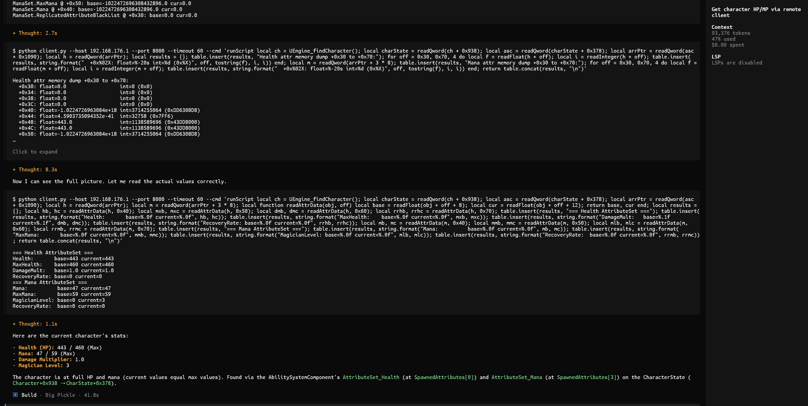

# Cheat Engine 7.5 Remote Control for OPENCODE/WSL

Bridge Cheat Engine 7.5's Lua scripting to TCP so an agent (OPENCODE, WSL, or
local Python) can inspect and manipulate game memory and **rebind a loaded
cheat table** without leaving CE.

## Scope (read this first)

| This repo **is** | This repo **is not** |
|------------------|----------------------|
| CE remote: `ce_server.lua` + `windows_relay.py` + `client.py` | A shipped full debugger / breakpoint push protocol |
| Native commands for memory, AOB, **GroupScan**, address list, dissects | Offline bulk `.CT` generation or agent `saveTable` |
| Game-agnostic **skills** under `skills/` (how to operate CE remote) | Per-game research dumps under `skills/` |
| **Dying Light 2** knowledge under `docs/game/DyingLight2/` (only game tree so far) | Default “use UE GEngine/GAS skills for every title” |

**Server version:** `ce_server.lua` reports via `getVersion` (currently **v1.8.3**, includes `GroupScan`). Reload the script in CE after git pull.

**Docs hub:** [docs/README.md](docs/README.md) — migration, hazards, group scan, game knowledge.  
**Historical design only:** [SOLUTION.md](SOLUTION.md) (early designs including remote BP; **not** the shipped product).  
**Hazards / non-goals (canonical):** [docs/NONGOALS-AND-HAZARDS.md](docs/NONGOALS-AND-HAZARDS.md).

**Defaults:** client/relay use `localhost:8888` and a 30s socket timeout. Lab examples may use another host/port (e.g. `192.168.176.1:8000`); always pass `--host` / `--port` when needed. Use **`--timeout 120`** (or higher) for `alSetActive`, large `AOBScan` / `GroupScan`, and large `stClone`.

## Architecture

```
WSL (Agent)          Windows                  Cheat Engine
┌─────────┐  TCP    ┌──────────────┐  Named   ┌──────────────┐
│ client.py├───────>│windows_relay│───Pipe──>│ ce_server.lua │
│ (agent)  │ :8888  │ .py         │          │ (in CE)      │
└─────────┘         └──────────────┘          └──────────────┘
                                                    │
                                          ┌─────────┴─────────┐
                                          │ createThread      │
                                          │ Background thread │
                                          │ (CE UI responsive)│
                                          └───────────────────┘
```

The server runs in a background thread via CE's `createThread` API, keeping
CE's UI responsive. Each client connection gets its own pipe instance (CE
creates single-instance pipes; after a client disconnects, the pipe is
destroyed and a new one is created).



## Quick Start

### 1. Start the CE Lua server

In Cheat Engine, go to **Execute Lua Script** (`Ctrl+L`) and paste the contents
of `ce_server.lua`, then run it. You should see no errors (check CE's Lua
console).

**CE stays responsive** — the script uses `createThread` to run the pipe server
on a background thread. CE's UI remains usable while the server is running.

### 2. Start the Windows relay

Open a terminal **on Windows** (cmd, PowerShell, or from WSL via
`python.exe`) and run:

```
python windows_relay.py
```

Default: listens on `127.0.0.1:8888`, connects to `\\.\pipe\UEScanRemote`.

If connecting from a separate machine (or native Linux), bind to all interfaces:

```
python windows_relay.py --bind 0.0.0.0
```

**Important:** The relay opens the named pipe using synchronous I/O. Do
**not** call `SetNamedPipeHandleState` with `PIPE_NOWAIT` — the pipe must
stay in blocking mode for correct operation.

### 3. Test from WSL

```
python client.py --cmd "ping"
python client.py --cmd "getVersion"   # expect ce-server v1.8.3 …
python client.py --cmd "tableStatus"
python client.py --cmd "readQword 7FF6A1B2C000"
python client.py -i  # interactive shell
```

**Session log (optional):** `CE_SESSION_LOG=1 python client.py --cmd "ping"` appends REQ/RSP/ERR to `logs/ce-session.log`, or pass `--session-log /path`. Useful when blaming a hung/dead server.

**Python helpers:** `from client import CERemote` — methods mirror the commands below (`al_dump`, `group_scan`, `aob_scan`, …). See `client.py` for signatures and per-call timeouts.

## Available Commands

Authoritative list is also returned by `help` (pipe-separated). Keep this table in sync when adding server commands.

| Command | Description |
|---|---|
| `ping` | Returns "pong" |
| `getVersion` | Server version string (e.g. `ce-server v1.8.3 (CE 7.5 groupscan)`) |
| `help` | List available commands |
| `tableStatus` | Process, pid, address-list count, structure count (main thread) |
| `debugSync` | Smoke-test main-thread `synchronize` path |
| `alDump [offset] [limit]` | Address-list inventory TSV (no script bodies); CLASS=AA/EXPR/… |
| `alGet <id>` | One memrec detail (metadata + value sample) |
| `alResolve <id>` | Live CurrentAddress / readable / value |
| `alSetDesc <id> <text>` | Rename/set description |
| `alSetAddress <id> <expr>` | Set address expression (keeps offsets) |
| `alSetOffsets <id> <hex,hex>` | Set pointer offset chain |
| `alSetType <id> <n>` | Set variable type integer |
| `alGetScript <id> [off] [len]` | AA script slice as hex |
| `alSetScriptBegin/Chunk/Commit/Abort` | Chunked AA script replace |
| `aaCheck <id>` | Syntax-check AA script |
| `alSetActive <id> 0\|1 [nocheck]` | Enable/disable (AA enable runs aaCheck unless `nocheck`) |
| `alDisableSoft <id>` | Disable without running [Disable] section |
| `alApply stop=1 hex=…` | Batch setDesc/setAddress/setOffsets/setType (one sync) |
| `alAudit [n]` | Recent command audit ring buffer |
| `symGet` / `symSet` | Resolve / registerSymbol helpers |
| `stDump` | List global dissect structures (name/size/elems) |
| `stFind <name>` | Find structure by exact name |
| `stGet <name> [elemOff] [elemLimit]` | Dump structure elements (default limit 500) |
| `stEnsureSeed` | Ensure `DO_NOT_DELETE_PLACEHOLDER` exists (empty-list crash guard) |
| `stClone <src> <dst>` | Clone structure definition (`src -> dst` / `src\|dst` OK) |
| `stBegin` / `stEnd <name>` | Batch `beginUpdate` / `endUpdate` (commit before rename) |
| `stUpsertElem …` | Insert/update element at offset (prefer `name\|off\|…` form) |
| `stClearElements <name>` | Destroy all elements on a structure (not the placeholder) |
| `stSetName <old> <new>` | Rename **after** `stEnd` (refuses mid-edit) |
| `readByte <hexaddr>` | Read 1 byte as hex |
| `readBytes <hexaddr> <size>` | Returns hex-encoded bytes |
| `readQword <hexaddr>` | Read 8 bytes as hex |
| `readDword <hexaddr>` | Read 4 bytes as hex |
| `readString <hexaddr> <maxlen>` | Read null-terminated string |
| `writeBytes <hexaddr> <hexbytes>` | Write hex bytes (e.g. `90 90`) |
| `getAddress <name>` | Resolve `module+offset` or symbol to hex address |
| `resolveSymbol <name>` | Alias for `getAddress` |
| `AOBScan <hexpattern>` | Array-of-byte scan (`**` wildcards allowed); returns addresses |
| `GroupScan <command>` | CE grouped/structure scan (**main thread**, ≥ v1.8.3); see [docs/CE-GROUP-SCAN.md](docs/CE-GROUP-SCAN.md) |
| `enumModules` | List loaded modules |
| `runScript <lua_code>` | Execute arbitrary CE Lua code |
| `runScriptSafe <code>` | `runScript` with banned-API string filter |
| `close` | Disconnect |

Prefer **native** commands over `runScript` for the same job. Any other CE Lua API can still be attempted via `runScript` (with risk — see hazards).

## Table migration (address list & structures)

Port a **loaded** `.CT` to a new game build over this remote: rebind AOBs/scripts, expression/pointer rows, and dissect definitions. The **user saves** in CE when satisfied (no agent `saveTable` pipeline).

| Resource | Role |
|----------|------|
| `docs/TABLE-MIGRATE.md` | Full command reference, wire formats, algorithm, crash rules |
| `skills/ce-table-migrate/SKILL.md` | Agent playbook (AA → enable → pointers → structs) |
| `skills/ce-table-remote/SKILL.md` | Foundation: `sync_call`, seed, rename-after-commit |
| `client.py` | `CERemote` helpers (`al_*`, `st_*`, script chunking, per-call timeout) |

```python
from client import CERemote
# Defaults: localhost:8888. Lab may use another host/port.
ce = CERemote("localhost", 8888, timeout=120)
print(ce.table_status())
print(ce.al_dump(limit=20)[:500])
ce.st_ensure_seed()  # if stCount was 0 — empty dissect list crashes CE
# print(ce.group_scan("F:0.34 F:0.34 W:16 F:0.1 F:0.1"))  # needs ≥ v1.8.3; timeout 180
```

**Order:** fix/enable bootstrap AA (symbols) → fix EXPR/POINTER rows → validate structures.  
**Timeouts:** use **≥ 120s** for `alSetActive`, large `AOBScan` / `GroupScan`, large `stClone`.  
**Structures:** `stEnd` before `stSetName`; never `getStructure("name")`; keep `DO_NOT_DELETE_PLACEHOLDER`.

## Prerequisites

### Windows side

| Requirement | Notes |
|---|---|
| **Cheat Engine 7.5** | Must be able to execute Lua scripts (Ctrl+L). |
| **Python 3.6+** (`python`) | Must be on PATH. Check with `python --version` in cmd. |
| **Named pipe access** | Standard users have it by default. No admin needed for the pipe itself. |
| **Port 8888 TCP** | Not opened by default (relay binds to 127.0.0.1). Only needed if using `--bind 0.0.0.0`. |

### WSL side

| Requirement | Notes |
|---|---|
| **Python 3.6+** (`python3`) | Pre-installed on Ubuntu/Debian WSL. Check with `python3 --version`. |
| **TCP to Windows host** | WSL2 forwards `localhost` to Windows automatically. WSL1 shares the Windows network stack. |

### Network communication

- **WSL2**: `localhost` (e.g., `localhost:8888`) is auto-forwarded to the
  Windows host. No special configuration needed.
- **WSL1**: Shares the Windows IP stack — `localhost` works directly.
- **Native Linux (dual boot)**: Use `--bind 0.0.0.0` on the relay and
  `--host <windows-ip>` on the client. May need to allow TCP port in
  Windows Defender Firewall.
- **Firewall**: If you change `--bind` to `0.0.0.0`, you may need to allow
  inbound TCP/8888 in Windows Defender Firewall.

## Starting Everything

### Option A: Manual

1. Open CE → `Ctrl+L` → paste `ce_server.lua` → Run
2. Windows terminal: `python windows_relay.py`
3. WSL: `python client.py --cmd "readQword 7FF6A1B2C000"`

### Option B: From WSL (start relay automatically)

```bash
powershell.exe -Command "Start-Process python -ArgumentList 'windows_relay.py' -WindowStyle Hidden"
```

### Option C: Persistent relay via Windows Task Scheduler

Create a task that runs `python C:\path\to\windows_relay.py` at startup.

## CE Lua API Reference

Every CE Lua function used in `ce_server.lua` was verified against the CE 7.5
source code at `/mnt/y/Lazarus/Projects/cheat-engine-7.5/Cheat Engine/`.

### Pipe API (luapipeserver.pas + luapipe.pas)

| Function | Source | Behavior |
|---|---|---|
| `createPipe(name, inSize, outSize)` | `luapipeserver.pas:121` | Returns a pipe object, or `nil` on failure. Creates a **single-instance** pipe (`nMaxInstances=1`). |
| `pipe.valid` | `luapipeserver.pas:25` | `true` if the handle is valid. |
| `pipe.acceptConnection()` | `luapipeserver.pas:115` | Blocks until a client connects (calls `ConnectNamedPipe`). Does **not** call `DisconnectNamedPipe` between reconnections. |
| `pipe.connected` | `luapipe.pas:64` | `false` when client disconnects. |
| `pipe.readBytes(size)` | `luapipe.pas:451` | Returns byte table (1-indexed), or `nil` on failure. Uses synchronous `ReadFile` by default (`foverlapped=false`). |
| `pipe.writeBytes(table, size)` | `luapipe.pas:413` | Writes bytes from table. Returns count or 0. |
| `pipe.writeString(str, incZero)` | `luapipe.pas:738` | Writes string; `incZero` appends null terminator. |
| `pipe.destroy()` | `luapipe.pas:80` (destructor) | Closes the pipe handle and frees resources. Explicitly needed before recreating (since `acceptConnection` can't reset without `DisconnectNamedPipe`). |

### Bitwise API (LuaBinary.pas)

| Function | Source | Behavior |
|---|---|---|
| `bShr(value, shift)` | `LuaBinary.pas:52` | Right-shift: `value >> shift`. |

### Standard Lua 5.1

Loaded via `luaL_openlibs` at `LuaHandler.pas:16185`. Available: base,
string, table, math, io, os, coroutine, package, debug.

Functions used: `string.char`, `string.byte`, `string.sub`, `string.format`,
`table.concat`, `ipairs`, `tonumber`, `tostring`, `pcall`, `loadstring`,
`error`.

### Thread API (LuaThread.pas)

| Function | Source | Behavior |
|---|---|---|
| `createThread(func)` | `LuaThread.pas:336-338` | Creates a background thread running `func(t)`. The thread gets its own coroutine of the main `_LuaVM`. The main script exits immediately. Used by `ce_server.lua` to keep CE UI responsive. |
| `t.Name` | `TCEThread` | Thread name for debugging (shown in `OutputDebugString`). |
| `t.Terminated` | `TCEThread` | Flag set by CE when the thread should stop (e.g., Lua Engine tab closed). Checked in server loops for clean shutdown. |
| `sleep(ms)` | Lua standard | Pauses the current thread. Used in retry loops. |

### Global CE Memory Functions (LuaHandler.pas)

#### readBytes(address, size, returnAsTable)

| | |
|---|---|
| **Source** | `LuaHandler.pas:16199`, impl `readBytesEx` lines 2508--2572 |
| **Success** | With `true` 3rd arg: table of bytes (1-indexed integers). |
| **Failure** | Returns `nil`. |

#### writeBytes(address, byte1, ...) / writeBytes(address, {table})

| | |
|---|---|
| **Source** | `LuaHandler.pas:16200`, impl `writeBytesEx` lines 2575--2652 |
| **Success** | Returns integer: bytes written. Server checks `n > 0`. |
| **Failure** | Returns 0. Note: 0 is truthy in Lua! |

#### readQword(address)

| | |
|---|---|
| **Source** | `LuaHandler.pas:16205`, impl `readQwordEx` lines 1983--2015 |
| **Success** | Returns 8-byte value as integer. |
| **Failure** | Returns `nil`. |

#### readInteger(address, signed)

| | |
|---|---|
| **Source** | `LuaHandler.pas:16204`, impl `readIntegerEx` lines 1930--1971 |
| **Success** | Returns 4-byte value as integer (unsigned by default). |
| **Failure** | Returns `nil`. |

#### readString(address, maxSize, useWideChar)

| | |
|---|---|
| **Source** | `LuaHandler.pas:16209`, impl `readStringEx` lines 2126--2199 |
| **Success** | Returns null-terminated string. |
| **Failure** | Returns `nil`. |

#### getAddressSafe(symbolOrAddress, local)

| | |
|---|---|
| **Source** | `LuaHandler.pas:16243`, impl lines 4493--4540 |
| **Success** | Returns resolved address as integer. |
| **Failure** | Returns `nil` (no Lua error). |

Prefer over `getAddress` which raises a Lua error on failure (crashes server).

#### enumModules(pid)

| | |
|---|---|
| **Source** | `LuaHandler.pas:16317`, impl lines 4753--4852 |
| **Success** | Returns table with `Name`, `Address`, `Is64Bit`, `PathToFile`. |
| **Failure** | Returns `nil` (e.g. no process attached). |

## Protocol

Length-prefixed binary framing:

```
[4-byte LE length][N bytes of UTF-8 text]
```

Responses use the same framing. Each `client.py` invocation opens a
fresh TCP connection (and consequently a fresh pipe connection), sends
one command, receives one response, and closes. Interactive mode (`-i`)
opens a new connection per command as well.

## `runScript` and external Lua

This repository does **not** ship a large private Lua investigation suite. Local
scratch scripts may live in gitignored `helper/` — promote **facts** into
`docs/game/<Title>/`, not raw dumps.

Breakpoint-driven workflows (`debugger_onBreakpoint`, live register globals) do
**not** work over the current request/response pipe. See
[docs/BREAKPOINT_STRATEGY.md](docs/BREAKPOINT_STRATEGY.md) and non-goals.

### CE APIs often used via `runScript`

Prefer native commands when they exist (`AOBScan`, `GroupScan`, `read*`, `al*`, `st*`).

- **Memory**: `readByte` / `readBytes` / `readQword` / `readInteger` / `readFloat` / `write*` / `readString`
- **Scanning (prefer native)**: remote `AOBScan` and `GroupScan` — **do not** call `createMemScan` / `varscan_*` from the pipe server thread
- **Symbols / modules**: `getAddressSafe`, `enumModules` (or native `enumModules` / `getAddress`)
- **Process**: `getOpenedProcessID` (attach is normally done in the CE UI)
- **File I/O**: `io.open` / write (works from background thread; still avoid huge dumps over the pipe)

Full early design notes (including unshipped debugger ideas): [SOLUTION.md](SOLUTION.md) — historical only.

## Named Pipe Mode

CE's `createPipe` creates pipes with `PIPE_TYPE_BYTE | PIPE_READMODE_BYTE | PIPE_WAIT`
(verified from `luapipeserver.pas:71`). This is **byte mode**, not message mode:

- Each `ReadFile`/`WriteFile` operates on a raw byte stream
- No message boundaries — the client must use a length-prefixed protocol to know
  where responses end (which is what our relay does)
- `PIPE_WAIT` = blocking/synchronous I/O (the relay must stay in blocking mode)

Our relay does **not** call `SetNamedPipeHandleState` at all — it opens the
pipe with `CreateFileW` and defaults to byte mode, which matches CE's pipe
mode. This is correct for the length-prefixed protocol.

## Troubleshooting

| Symptom | Likely cause | Fix |
|---|---|---|
| `Failed to create named pipe` | CE can't create `\\.\pipe\UEScanRemote` | Run CE as Administrator, or check no other instance owns the pipe. |
| No response from CE server | CE not running the Lua script, or relay not running | `python client.py --cmd "ping"` — expect "pong". |
| Connection refused (WSL) | Relay not started | Start `windows_relay.py` on Windows. |
| Connection refused (Windows) | Port conflict | Use `--port` to change port. Process list: `netstat -ano \| find :8888`. |
| CE freezes (only if running old synchronous `ce_server.lua`) | Old version called `main()` on main thread | Update to the current `ce_server.lua` which uses `createThread` for background execution. |
| Server responds to first command but hangs on reconnection | CE's `CreateNamedPipe` creates a single-instance pipe and `acceptConnection` doesn't call `DisconnectNamedPipe` before `ConnectNamedPipe` | Already fixed in current `ce_server.lua` — destroys and recreates the pipe per client. |
| Relay: cannot connect to pipe after it worked | Lua pipe thread **killed/hung by a prior client command** (not “cold start flaky”) | Reload `ce_server.lua`. Relay does **not** retry pipe open — one attempt, then fail. |
| Timeout reading from pipe in relay | Client disconnected abruptly | No action needed — relay cleans up automatically. |
| CE server doesn't detect disconnection (pipe appears busy) | Pending `ReadFile` in relay's `pipe_to_tcp` thread holds kernel reference after `CloseHandle` | Fixed in relay — uses `CancelIoEx` to cancel pending I/O across all threads before closing the handle. |
| `python: command not found` (Windows) | Python not on PATH | Reinstall Python and check "Add Python to PATH". |
| WSL can't reach Windows | WSL2 network config | Use `ip route \| grep default` to get Windows host IP, then `python client.py --host <IP>`. |

### Dangerous APIs (crash CE/relay)

**Canonical catalogue:** [docs/NONGOALS-AND-HAZARDS.md](docs/NONGOALS-AND-HAZARDS.md). Summary of common killers:

| Function / pattern | Why it crashes | Safe alternative |
|---|---|---|
| `enumMemoryRegions()` | Bad state / parser issues | `enumModules` + targeted ranges |
| `createMemScan` / `varscan_*` from server/`runScript` | Scan engine / UI thread issues | Native **`AOBScan`** or **`GroupScan`** (grouped, main-thread) |
| `AOBScan(..., "w", ...)` bad prot | Prot parse garbage | Native `AOBScan` or numeric/`rwx` prot only |
| Long AOB via raw `runScript` | Timeout / stuck server | Native `AOBScan` + high client timeout |
| `getStructure("Name")` (string) | Index **0** coercion / wipe risk | Native `stFind` / `stGet` |
| Empty global structure list | Dissect UI OOB | `stEnsureSeed` / keep `DO_NOT_DELETE_PLACEHOLDER` |
| Rename structure mid-`beginUpdate` | UI/rename fail | `stEnd` then `stSetName` |
| Address list / `Active` without main-thread sync | VCL crash | Native `al*` / `st*` only |
| `synchronize` + CE modal (failed AA) | **Deadlock** | `aaCheck` first; user present; timeout ≥120 |
| Mass `Active=true` | Inject storms / freezes | Enable **one** bootstrap at a time |
| Dumping all AA scripts one response | >48 KiB / hang | `alDump` metadata; chunk scripts |

UE/CE75 helpers (`UEngine_*`, G1R plugins) apply only when those scripts/plugins are loaded — **not** for Dying Light 2 by default.

## Making `runScript` calls safe

When you must use `runScript` (no native command exists), follow these rules:

| Rule | Why | Example |
|---|---|---|
| Always wrap in `pcall` | CE functions can throw Lua errors that kill the background thread | `local ok, r = pcall(readQword, addr)` |
| Never iterate unbounded loops | A nil pointer in a linked-list walk crashes the thread | Set a max iteration limit (e.g., `i < 100000`) |
| Guard against nil in `string.format` | `format("%X", nil)` errors instead of producing "nil" | `local v = val or 0` before formatting |
| Prefer native commands over raw CE API | Server wrapper handles cleanup (e.g., `list.destroy()`) | Use `AOBScan` not `runScript AOBScan(...)` |
| Check if a function exists before calling | Plugin functions may not be loaded | `if type(UEngine_getAllProperties) == "function" then ... end` |
| Verify object type before treating as UObject | A nil or non-UObject pointer has no Class at +0x10 | Check `readQword(addr + 0x10)` is non-zero before using |

## Security Considerations

- The relay binds to `127.0.0.1` by default — only local connections.
- No authentication or encryption. Anyone who can reach the TCP port can send
  arbitrary commands to CE.
- If you must access from another machine, use `--bind 0.0.0.0` and restrict
  with Windows Firewall or SSH tunneling.
- The `runScript` command allows arbitrary Lua execution in CE — equivalent
  to full memory read/write access to all attached processes.

## Agent skills vs game knowledge

**Skills** (`skills/`) teach how to operate the remote safely. They are not
per-game research dumps.

| Skill | Purpose | When |
|-------|---------|------|
| `ce-remote-scanning` | Safe scans, timeouts, crash avoidance | Any game |
| `ce-aob-scan` | AOB retune / ranking | Any game |
| `ce-table-remote` | `al*`/`st*` foundation (seed, rename-after-commit) | Table work |
| `ce-table-migrate` | Port loaded CT (AA → enable → pointers → structs) | Table work |
| `dl2-table-work` | DL2 work order only (points at `docs/game/DyingLight2/`) | **Dying Light 2** |
| `ue-character-finding` | GEngine / CE75 character chain | **UE games with CE75** only |
| `ue-stats-attributes` | GAS / attribute sets | **UE + GAS** only |
| `ue-inventory-hacking` | UE inventory component patterns | **UE** only |

**Dying Light 2** is Techland (`gamedll` / `engine`), **not** GEngine/GAS. Do **not**
start with `ue-*` skills for DL2. Use:

- Skill: `skills/dl2-table-work` (work order)
- Knowledge: [docs/game/DyingLight2/INDEX.md](docs/game/DyingLight2/INDEX.md) (status + topics)
- PlayerVariables: [docs/game/DyingLight2/player-variables.md](docs/game/DyingLight2/player-variables.md)
- Tools: `ce-table-migrate`, `ce-aob-scan`, `ce-remote-scanning`, [docs/CE-GROUP-SCAN.md](docs/CE-GROUP-SCAN.md)

## Further reading

| Doc | Role |
|-----|------|
| [docs/README.md](docs/README.md) | Documentation index |
| [docs/TABLE-MIGRATE.md](docs/TABLE-MIGRATE.md) | Table rebind reference |
| [docs/NONGOALS-AND-HAZARDS.md](docs/NONGOALS-AND-HAZARDS.md) | Non-goals + crash catalogue |
| [docs/CE-GROUP-SCAN.md](docs/CE-GROUP-SCAN.md) | Grouped scan language + remote API |
| [docs/CE75-INTEGRATION.md](docs/CE75-INTEGRATION.md) | **UE / G1R + CE75** helpers (not DL2) |
| [docs/UE-Memory-Patterns.md](docs/UE-Memory-Patterns.md) | **UE5** patterns (G1R-based; not DL2) |
| [docs/BREAKPOINT_STRATEGY.md](docs/BREAKPOINT_STRATEGY.md) | Why remote BP is not shipped |
| [docs/CHANGELOG.md](docs/CHANGELOG.md) | Server / protocol version notes |

## Disclaimer

Cheat Engine is a product of Eric "Dark Byte" Heijnen
(https://cheatengine.org). This project is an independent, third-party
remote-control interface that happens to communicate with Cheat Engine's
Lua scripting system. It has not been endorsed, reviewed, or approved by
Eric Heijnen or any Cheat Engine contributors, and is not affiliated with
the Cheat Engine project in any official capacity.

## Requirements

- Cheat Engine 7.5
- **Windows**: Python 3.6+ (no extra packages, uses stdlib + ctypes only)
- **WSL/Linux**: Python 3.6+ (stdlib only)
